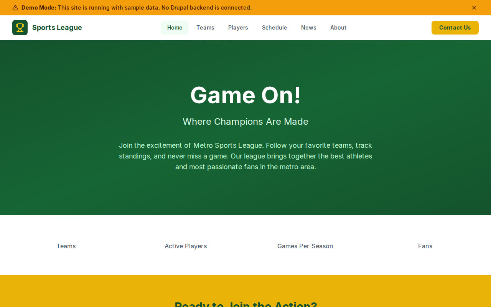

# Decoupled Sports League

A sports league website starter built with Decoupled Drupal and Next.js. Designed for amateur leagues, recreational sports organizations, and competitive athletic associations that need team rosters, player profiles, game schedules, and league news.



## Features

- **Teams** - Team profiles with division, coach, win/loss record, and team imagery
- **Players** - Player profiles with position, jersey number, team affiliation, and bio
- **Game Schedule** - Upcoming and past games with home/away teams, venues, dates, and scores
- **League News** - News articles, game recaps, trade updates, and community stories
- **Homepage** - Hero section, league statistics, featured teams, and call-to-action
- **Static Pages** - About, rules, and contact pages for league information

## Quick Start

### 1. Clone the template

```bash
npx degit nextagencyio/decoupled-sports-league my-sports-league
cd my-sports-league
npm install
```

### 2. Run interactive setup

```bash
npm run setup
```

This interactive script will:
- Authenticate with Decoupled.io (opens browser)
- Create a new Drupal space
- Wait for provisioning (~90 seconds)
- Configure your `.env.local` file
- Import sample content

### 3. Start development

```bash
npm run dev
```

Visit [http://localhost:3000](http://localhost:3000)

---

## Manual Setup

If you prefer to run each step manually:

<details>
<summary>Click to expand manual setup steps</summary>

### Authenticate with Decoupled.io

```bash
npx decoupled-cli@latest auth login
```

### Create a Drupal space

```bash
npx decoupled-cli@latest spaces create "My Sports League"
```

Note the space ID returned (e.g., `Space ID: 1234`). Wait ~90 seconds for provisioning.

### Configure environment

```bash
npx decoupled-cli@latest spaces env 1234 --write .env.local
```

### Import content

```bash
npm run setup-content
```

This imports:
- Homepage with league statistics and CTAs
- 4 Teams (Metro Thunderbolts, Riverside Hawks, Highland Wolves, Central Lions)
- 6 Players (Alex Martinez, Jordan Chen, Chioma Okafor, Maria Rodriguez, DeVonte Jackson, Lisa Thompson)
- 5 Scheduled Games with venues and matchup details
- 3 News Articles (season preview, trade deadline recap, community day)
- 2 Static Pages (About, League Rules)

</details>

## Content Types

### Team
- Title, Body
- Division (taxonomy)
- Head Coach
- Wins, Losses
- Team Image

### Player
- Title (name), Body (bio)
- Team Name
- Position (taxonomy)
- Jersey Number
- Photo

### Schedule Entry
- Title, Body
- Home Team, Away Team
- Game Date
- Venue
- Score
- Game Image

### News Article
- Title, Body
- Featured Image
- Category (taxonomy)
- Featured flag

### Basic Page
- Title, Body

## Customization

### Colors & Branding
Edit `tailwind.config.js` to customize colors, fonts, and spacing. The default theme uses green and yellow to evoke a classic sports aesthetic.

### Content Structure
Modify `data/sports-league-content.json` to add or change content types and sample content.

### Components
React components are in `app/components/`. Update them to match your league's design needs.

## Demo Mode

Demo mode allows you to showcase the application without connecting to a Drupal backend. It displays mock content for the homepage, teams, players, schedule, and news.

### Enable Demo Mode

Set the environment variable:

```bash
NEXT_PUBLIC_DEMO_MODE=true
```

Or add to `.env.local`:
```
NEXT_PUBLIC_DEMO_MODE=true
```

### What Demo Mode Does

- Shows a "Demo Mode" banner at the top of the page
- Returns mock data for all GraphQL queries
- Displays sample teams, players, games, and news
- No Drupal backend required

### Removing Demo Mode

To convert to a production app with real data:

1. Delete `lib/demo-mode.ts`
2. Delete `data/mock/` directory
3. Delete `app/components/DemoModeBanner.tsx`
4. Remove `DemoModeBanner` from `app/layout.tsx`
5. Remove demo mode checks from `app/api/graphql/route.ts`

## Deployment

### Vercel (Recommended)
[](https://vercel.com/new/clone?repository-url=https://github.com/nextagencyio/decoupled-sports-league)

Set `NEXT_PUBLIC_DEMO_MODE=true` in Vercel environment variables for a demo deployment.

### Other Platforms
Works with any Node.js hosting platform that supports Next.js.

## Documentation

- [Decoupled.io Docs](https://www.decoupled.io/docs)
- [Next.js Documentation](https://nextjs.org/docs)
- [Drupal GraphQL](https://www.decoupled.io/docs/graphql)

## License

MIT
